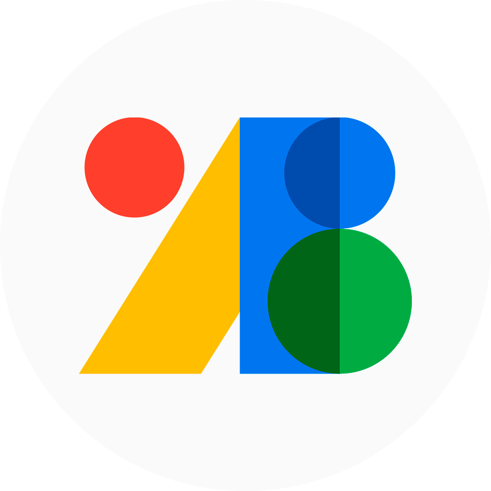
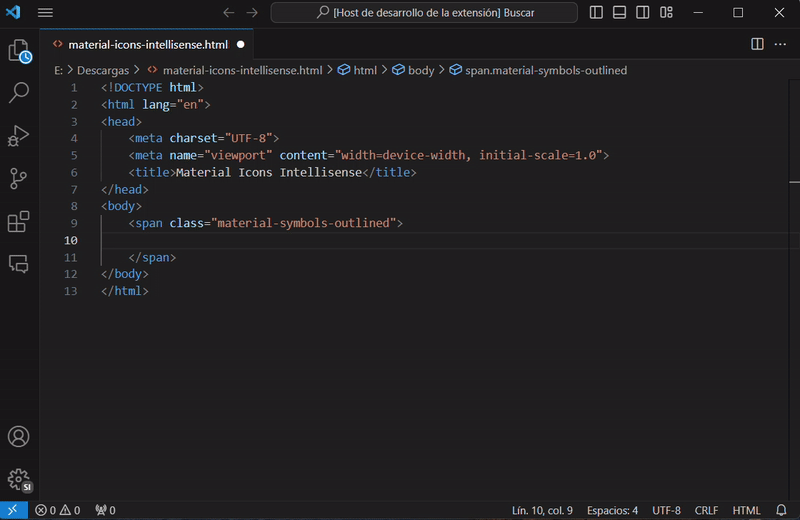

<p align="center">
  
</p>

<h1 align="center">
  Material Icons Intellisense for VS Code
</h1>
<p align="center">
  Suggestions, Auto-complete & Preview of Material Icons or Material Symbols
</p>
<p align="center">
  <a href="https://marketplace.visualstudio.com/items?itemName=MarianoIbarra.material-icons-intellisense">
    
  </a>
  <a href="https://marketplace.visualstudio.com/items?itemName=MarianoIbarra.material-icons-intellisense">
    
  </a>
  <a href="https://marketplace.visualstudio.com/items?itemName=MarianoIbarra.material-icons-intellisense">
    
  </a>
</p>

## Features



### For HTML vanilla, React, Vue

```html
<span class="material-symbols-outline">home</span>
```

The extension matches with `span` tag with any of the following classes:

- material-symbols-outlined
- material-symbols-rounded
- material-symbols-sharp
- material-icons
- material-icons-outlined
- material-icons-round
- material-icons-sharp
- material-icons-two-tone

### For Angular

```html
<mat-icon>home</mat-icon>
```

The extension matches with `mat-icon`. See [Angular Material](https://material.angular.io/components/icon/overview) for more information.

## Requirements

To use this extension, you need to have **Material symbols** or **Material icons** in your project. You can find more information about Material symbols [here](https://developers.google.com/fonts/docs/material_symbols#use_in_web).

## Extension Settings

### `material-icons-intellisense.version`

This configuration allows you to select the version to use:

- `3` See [Material Icons](https://developers.google.com/fonts/docs/material_icons)
- `4` See [Material Symbols](https://developers.google.com/fonts/docs/material_symbols)

```json
{
  "material-icons-intellisense.version": "4"
}
```

### `material-icons-intellisense.preview.backgroundColor`

Background color of the preview icon. _Supports any valid CSS color value._

```json
{
  "material-icons-intellisense.preview.backgroundColor": "#ffffff"
}
```

### `material-icons-intellisense.preview.foregroundColor`

Foreground color of the preview icon. _Supports any valid CSS color value._

```json
{
  "material-icons-intellisense.preview.foregroundColor": "#000000"
}
```

### `material-icons-intellisense.preview.iconFill`

Show icons with `fill` style in the preview.

```json
{
  "material-icons-intellisense.preview.iconFill": true
}
```

## Upcoming Features

Here are some of the upcoming features that will be added to Material Icons Intellisense:

- Inline decorator to preview icon
- Integration with other popular code editors
- Customizable html tag & class to match

Stay tuned for these exciting updates in future releases!
